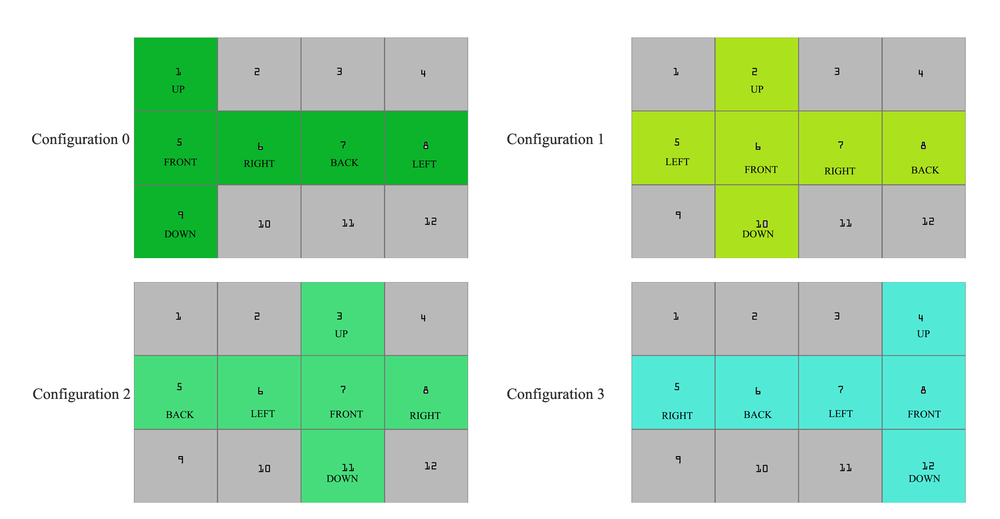

# SkyboxGen
If you need to create skyboxes to be used in Unity or another tool, you can choose a source image as base for the skybox.
A Skybox is a 6 side box  (Up, Down, Front, Back, Left, Right) that represents the background seen by a camera in some 3D tools like Unity.
Generate a set of skybox tiles from a single image in four different configurations:

      

Usage: Skyboxgen skyboxType[0..3] file

Example: Skyboxgen 0 c:\temp\myImage.png

Note. Only for Windows platforms
